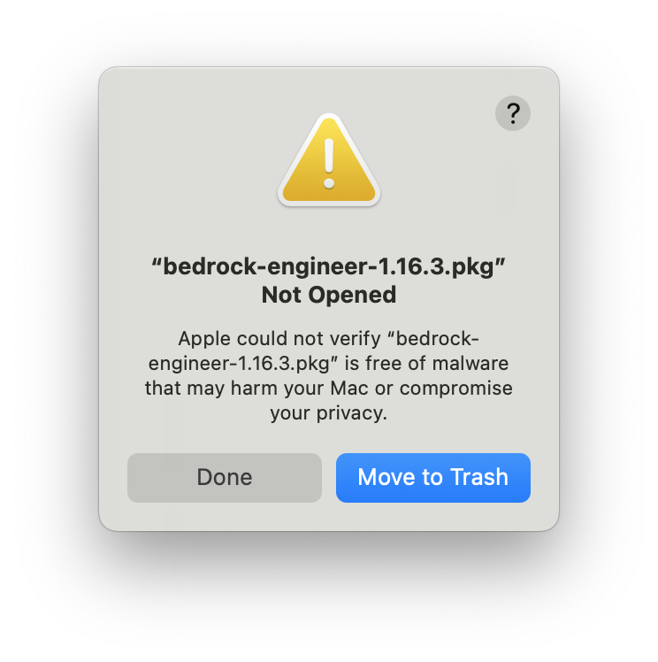

Language: [English](./README.md) / [Japanese](./README-ja.md)

> [!IMPORTANT]

# 🧙 Bedrock Engineer

Bedrock Engineer は、[Amazon Bedrock](https://aws.amazon.com/bedrock/) を活用したソフトウェア開発タスクのための AI アシスタントです。大規模な言語モデルと実際のファイルシステム操作、Web検索機能などを含む自律的な AI エージェントがあなたの開発を支援します。

## 💻 デモ

https://github.com/user-attachments/assets/f6ed028d-f3c3-4e2c-afff-de2dd9444759

## Deck

- [English](https://speakerdeck.com/gawa/introducing-bedrock-engineer-en)
- [Japanese](https://speakerdeck.com/gawa/introducing-bedrock-engineer)

## 🍎 はじめに

Bedrock Engineer はネイティブアプリです。アプリをダウンロードするか、ソースコードをビルドして使用してください。

### Download

MacOS:

[](https://github.com/aws-samples/bedrock-engineer/releases/latest/download/bedrock-engineer-1.17.0.pkg)

Windows:

[](https://github.com/aws-samples/bedrock-engineer/releases/latest/download/bedrock-engineer-1.17.0-setup.exe)

MacOS に最適化されていますが、Windows, Linux OS でもビルドして使用できます。不具合がある場合、issue に起票ください。

<details>
<summary>Tips for Installation</summary>

### インストール

1. 最新リリース（PKGファイル）をダウンロードします
2. PKGファイルをダブルクリックしてインストールを開始します
3. セキュリティ警告が表示された場合、以下の手順に従います
4. アプリを起動し、AWS認証情報を設定します（プロキシ環境の場合はプロキシ設定も併せて設定してください）

### macOS セキュリティ警告

PKGファイルを開く際に、以下のセキュリティ警告が表示される場合があります：



**解決方法：**

1. 「完了」をクリックして警告ダイアログを閉じます
2. システム環境設定 → プライバシーとセキュリティを開きます
3. セキュリティセクションまでスクロールします
4. 「お使いのMacを保護するために "bedrock-engineer-1.17.0.pkg" がブロックされました」を見つけます
5. 「このまま開く」ボタンをクリックします

このセキュリティ警告は、アプリケーションがMac App Store経由で配布されていないために表示されます。


### 設定ファイルの問題

アプリケーション起動時に設定ファイルエラーが発生する場合、以下の設定ファイルを確認ください。設定ファイルを削除してアプリケーションを再起動し直しても起動できない場合、issue に起票ください。

`/Users/{{username}}/Library/Application Support/bedrock-engineer/config.json`

</details>

### ビルド

まず、npmモジュールをインストールします。

```bash
npm ci
```

次に、アプリケーションパッケージをビルドします。

```bash
npm run build:mac
```

または

```bash
npm run build:win
```

または

```bash
npm run build:linux
```

`dist`ディレクトリに保存されたアプリケーションを使用します。

## エージェントチャット

開発ができる自律的な AI エージェントが、あなたの開発を支援します。これは [Cline](https://github.com/cline/cline) のような AI アシスタントに似た機能を提供していますが、VS Code のようなエディタに依存しない独自の UI を備えています。これにより、Bedrock Engineer のエージェントチャット機能では、よりリッチな図解と対話型の体験が可能になります。また、エージェントのカスタマイズ機能により、開発以外のユースケースにおいても、エージェントを活用することができます。

### 主な機能

- 💬 人間のような Amazon Nova, Claude, Meta llama モデルとの対話型チャットインターフェース
- 📁 ファイルシステム操作（フォルダ作成、ファイル作成、ファイル読み/書き）
- 🔍 Tavily APIを使用したWeb検索機能
- 🏗️ プロジェクト構造の作成と管理
- 🧐 コード分析と改善提案
- 📝 コードの生成と実行
- 📊 データ分析と可視化
- 💡 エージェントのカスタマイズと管理
- 🛠️ ツールのカスタマイズと管理
- 🔄 チャット履歴の管理
- 🌐 多言語対応
- 🛡️ ガードレール対応
- 💡 軽量処理用モデルによるコスト最適化

|  |  |
| :----------------------------------------------------: | :--------------------------------------------------: |
|                    コード分析と図解                    |            Tavily API を使用した Web 検索            |

### 基本的な使い方

1. 左上のメニューからエージェントを選択します
2. 左下のツールアイコンをクリックして、エージェントが使用できるツールを選択します
3. チャットインターフェースでエージェントと対話します

詳細なドキュメントについては、以下のリンクを参照してください：

- [はじめに](./docs/agent-chat/getting-started-ja.md) - 基本的なセットアップと使い方
- [エージェントのカスタマイズ](./docs/agent-chat/agent-customization-ja.md) - エージェントのカスタマイズ方法
- [ツールの概要](./docs/agent-chat/tools-overview-ja.md) - ツール選択とカスタマイズ
- [ツールリファレンス](./docs/agent-chat/tools/) - 利用可能なツールの詳細
- [高度な機能](./docs/agent-chat/advanced-features/) - MCPクライアント統合などの高度な機能

### MCP (Model Context Protocol) クライアント統合

Model Context Protocol (MCP) クライアント統合により、Bedrock Engineerは外部のMCPサーバーに接続し、強力な外部ツールを動的にロードして使用することができるようになりました。この統合により、AIアシスタントがMCPサーバーが提供するツールにアクセスして利用できるようになり、その能力が拡張されます。

MCPサーバーの設定方法の詳細については、[MCPサーバー設定ガイド](./docs/mcp-server/MCP_SERVER_CONFIGURATION-ja.md)を参照してください。

## Background Agent

cron 式を使用して AI エージェントタスクを指定した間隔で自動実行します。Background Agent により、リアルタイム実行通知付きの継続的なワークフロー自動化が可能になります。


### 主な機能

- 🕒 **スケジュール実行**: cron式を使用したタスクの自動化（毎時、毎日、毎週など）
- 🔄 **セッション継続**: タスク実行間での会話コンテキストの維持
- ⚡ **手動実行**: 必要に応じて即座にタスクを実行
- 📊 **実行追跡**: タスク履歴とパフォーマンスの監視
- 🔔 **リアルタイム通知**: タスク結果の即座フィードバック

## Agent Directory

Agent Directoryは、優れたコントリビューターによって作成されたAIエージェントを発見してすぐに使用できるコンテンツハブです。様々なタスクや専門分野向けに設計された厳選済みのエージェントコレクションを提供しています。


### 機能

- **コレクションの閲覧** - コミュニティによって作成された専門的なエージェントの拡大するライブラリを探索
- **検索とフィルタリング** - 検索機能またはタグによるフィルタリングを使用して、ニーズに合ったエージェントを素早く発見
- **詳細情報の表示** - 各エージェントの作成者、システムプロンプト、対応ツール、使用シナリオなどの包括的な情報を確認
- **ワンクリック追加** - ワンクリックで任意のエージェントを個人コレクションに追加し、すぐに使用開始
- **エージェントの投稿** - コントリビューターになって、あなたのカスタムエージェントをコミュニティと共有

### Agent Directoryの使い方

1. **閲覧と検索** - 検索バーを使用して特定のエージェントを見つけるか、コレクション全体を閲覧
2. **タグでフィルタリング** - タグをクリックしてカテゴリ、専門分野、機能によりエージェントをフィルタリング
3. **詳細を表示** - 任意のエージェントを選択して、システムプロンプト全文、対応ツール、使用シナリオを確認
4. **コレクションに追加** - 「マイエージェントに追加」をクリックして、個人コレクションにエージェントを追加

### 組織共有

AWS S3ストレージを使用して、チームや組織内でエージェントを共有できます。この機能により以下が可能になります：

- **チームにおける共有** - 特定のチームや部門とカスタムエージェントを共有
- **集中管理** - S3バケットを通じて組織固有のエージェントを管理

詳細なセットアップ手順については、[組織共有ガイド](./docs/agent-directory-organization/README-ja.md)を参照してください。

### エージェントの追加方法

コントリビューターになって、あなたのカスタムエージェントをコミュニティと共有しましょう：

1. カスタムエージェントを共有ファイルとしてエクスポート
2. 作者としてGitHubユーザー名を追加（推奨）
3. プルリクエストまたはGitHub Issueでエージェントを提出

Agent Directoryに貢献することで、Bedrock Engineerの機能を向上させる専門的なAIエージェントの貴重なリソース構築に協力できます。

## プロキシ環境での使用

bedrock-engineer はプロキシ環境での使用に対応しています。

### 設定方法

1. アプリを起動し、設定画面を開きます
2. 「Proxy Settings」セクションを見つけます
3. 「プロキシを有効にする」にチェックを入れます
4. 以下の情報を入力します：
   - プロキシホスト: プロキシサーバーのホスト名またはIPアドレス
   - ポート: プロキシサーバーのポート番号（通常は8080）
   - プロトコル: HTTPまたはHTTPS
   - ユーザー名・パスワード: 認証が必要な場合のみ入力

### 対応環境

- HTTP/HTTPSプロキシ
- 認証付きプロキシ（ユーザー名・パスワード認証）
- 企業環境での使用

プロキシ設定は全てのAWS SDK接続に適用され、Amazon Bedrock API呼び出し、S3アクセス、その他のAWSサービス接続で使用されます。

## Nova Sonic Voice Chat

Amazon Nova Sonicを活用したリアルタイム音声会話機能です。AIエージェントと自然な音声でやり取りできます。


### 主な機能

- 🎤 **リアルタイム音声入力**: マイクを使ってAIと自然な会話
- 🗣️ **複数音声選択**: 3種類の音声特性から選択可能
  - Tiffany: 温かく親しみやすい
  - Amy: 冷静で落ち着いている
  - Matthew: 自信に満ち、威厳的
- 🤖 **エージェントカスタマイズ**: Agent Chatと同様にカスタムエージェントが利用可能
- 🛠️ **ツール実行**: エージェントが音声会話中にツールを実行
- 🌐 **多言語対応**: 現在は英語のみサポート、将来的に他言語対応予定

Nova Sonic Voice Chatを使用することで、従来のテキストベースのやり取りとは異なる、より自然で直感的なAIとの対話体験を提供します。音声によるコミュニケーションにより、効率的で親しみやすいAIアシスタント体験が可能になります。

### 重複した許可ダイヤログの解決

OS の許可ダイヤログ（マイクロフォンアクセスなど）が重複して表示される場合、アプリケーションをビルド・インストールした後に以下のコマンドを実行してアドホック署名を追加することで、この問題を解決できます：

```bash
sudo codesign --force --deep --sign - "/Applications/Bedrock Engineer.app"
```

このコマンドは、アプリケーションにアドホックコード署名を適用し、システムの許可ダイヤログが重複して表示される問題を防ぎます。

## Website Generator

ウェブサイトを描画するソースコードを生成し、リアルタイムにプレビューします。現在は以下のライブラリに対応しています。また、追加で指示を与えることで対話的にコードを生成することができます。

- React.js（w/ Typescript）
- Vue.js（w/ Typescript）
- Svelte.js
- Vanilla.js

以下は Website Generator によって生成された画面の例です。

|  |  |  |
| :--------------------------------------------: | :--------------------------------------------------------------------: | :------------------------------------------------------------------: |
|               観葉植物のECサイト               |                           データの可視化API                            |                          ヘルスケアのブログ                          |

また、以下のスタイルがプリセットとしてサポートされています。

- インラインスタイリング
- Tailwind.css
- Material UI（Reactモードのみ）

### Agentic-RAG 機能

Amazon Bedrock の Knowledge Base に接続することで、任意のデザインシステム、プロジェクトソースコード、Webサイトのスタイルなどを参照してウェブサイトを生成できます。

事前に Knowledge Base にソースコードとクロールしたWebページを保存する必要があります。Knowledge Base にソースコードを登録する際は、[gpt-repositoy-loader](https://github.com/mpoon/gpt-repository-loader) などの方法を使用してLLMが簡単に理解できる形式に変換することをお勧めします。Figma のデザインファイルは HTML, CSS の形式にエクスポートしたものを Knowledge Base に登録することで参照可能になります。

画面下部の「Connect」ボタンをクリックし、ナレッジベースIDを入力してください。

### ウェブ検索エージェント機能

Website Generator には、ウェブ検索機能を活用したコード生成エージェントが統合されています。この機能により、最新のライブラリ情報、デザイントレンド、コーディングベストプラクティスを参照しながら、より洗練されたウェブサイトを生成できます。検索機能を使用するには、画面下部の「Search」ボタンをクリックして有効化してください。

## Step Functions Generator

AWS Step Functions の ASL 定義を生成し、リアルタイムにプレビューします。


## Diagram Generator

自然言語の説明からAWSアーキテクチャ図を簡単に作成できます。Diagram GeneratorはAmazon Bedrockの強力な言語モデルを活用して、テキスト説明からプロフェッショナルなAWSアーキテクチャ図を生成します。

主な機能：

- 🏗️ 自然言語の説明からAWSアーキテクチャ図を生成
- 🔍 Web検索機能を統合し、最新情報に基づいた正確な図を作成
- 💾 図の履歴を保存して簡単に参照・改善
- 🔄 図の改善に関するインテリジェントな推奨事項を取得
- 🎨 AWSアーキテクチャアイコンを使用したプロフェッショナルな図のスタイリング
- 🌐 多言語対応

生成された図はdraw.io互換のXML形式で作成されるため、必要に応じてさらに編集やカスタマイズが可能です。


## アプリケーション推論プロファイル

Bedrock Engineer は、詳細なコスト追跡と配分のためのAWS Bedrockアプリケーション推論プロファイルをサポートしています。タグ付きのカスタム推論プロファイルを作成して、プロジェクト、部門、またはユースケース別にコストを追跡できます。

詳細なセットアップ手順と例については、以下を参照してください：

- [アプリケーション推論プロファイルガイド (日本語)](./docs/inference-profile/INFERENCE_PROFILE-ja.md)

## Star History

[](https://star-history.com/#aws-samples/bedrock-engineer&Date)

## Security

詳細については、[CONTRIBUTING](CONTRIBUTING.md#security-issue-notifications) を参照してください。

## ライセンス

This library is licensed under the MIT-0 License. See the LICENSE file.

このソフトウェアは [Lottie Files](https://lottiefiles.com/free-animation/robot-futuristic-ai-animated-xyiArJ2DEF) を使用しています。
