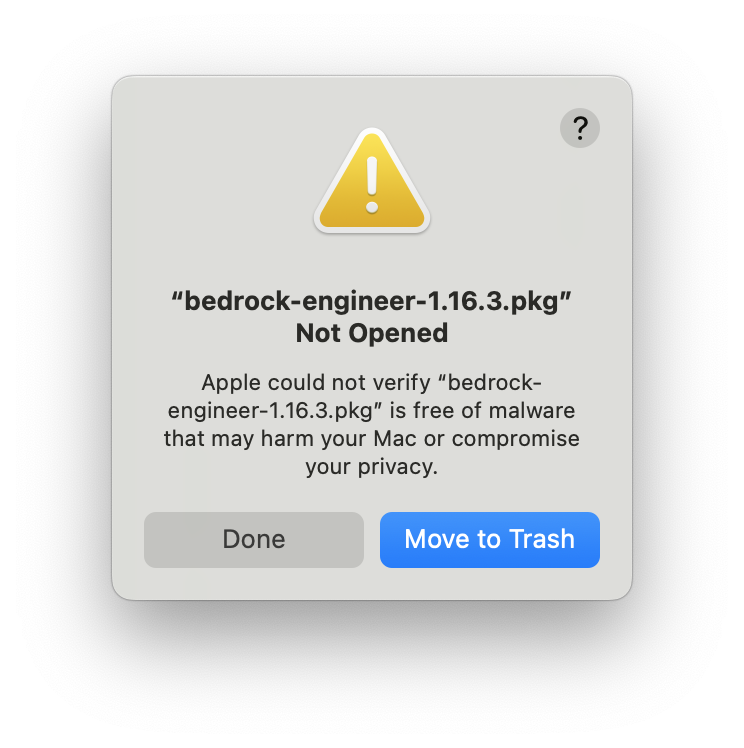
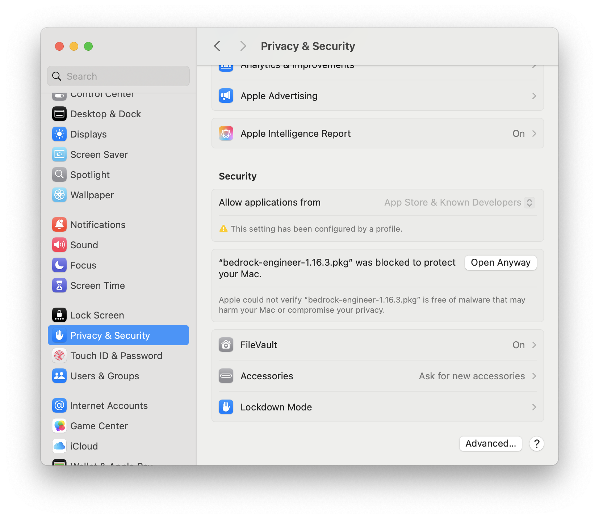
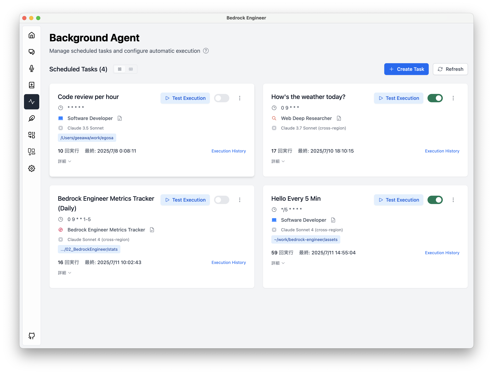

[](https://deepwiki.com/aws-samples/bedrock-engineer) [](https://catalog.us-east-1.prod.workshops.aws/workshops/57e0af6e-41a5-42cc-98e0-1f1a3fd0c6c4/ja-JP)

Language: [English](./README.md) / [Japanese](./README-ja.md)

# 🧙 Bedrock Engineer

Bedrock Engineer is Autonomous software development agent apps using [Amazon Bedrock](https://aws.amazon.com/bedrock/), capable of customize to create/edit files, execute commands, search the web, use knowledge base, use multi-agents, generative images and more.

## 💻 Demo

https://github.com/user-attachments/assets/f6ed028d-f3c3-4e2c-afff-de2dd9444759

## Deck

- [English](https://speakerdeck.com/gawa/introducing-bedrock-engineer-en)
- [Japanese](https://speakerdeck.com/gawa/introducing-bedrock-engineer)

## 🍎 Getting Started

Bedrock Engineer is a native app, you can download the app or build the source code to use it.

### Download

MacOS:

[](https://github.com/aws-samples/bedrock-engineer/releases/latest/download/bedrock-engineer-1.17.0.pkg)

Windows:

[](https://github.com/aws-samples/bedrock-engineer/releases/latest/download/bedrock-engineer-1.17.0-setup.exe)

It is optimized for MacOS, but can also be built and used on Windows and Linux OS. If you have any problems, please report an issue.

<details>
<summary>Tips for Installation</summary>

### Installation

1. Download the latest release (PKG file)
2. Double-click the PKG file to start installation
3. If you see a security warning, follow the steps below
4. Launch the app and configure your AWS credentials

### macOS Security Warning

When opening the PKG file, you may see this security warning:



**To resolve this:**

1. Click "Done" to dismiss the warning dialog
2. Open System Preferences → Privacy & Security
3. Scroll down to the Security section
4. Find "bedrock-engineer-1.17.0.pkg was blocked to protect your Mac"
5. Click "Open Anyway" button

This security warning appears because the application is not distributed through the Mac App Store.



### Configuration Issues

If a configuration file error occurs when starting the application, please check the following configuration files. If you cannot start the application even after deleting the configuration files and restarting it, please file an issue.

`/Users/{{username}}/Library/Application Support/bedrock-engineer/config.json`

</details>

### Build

First, install the npm modules:

```bash
npm ci
```

Then, build application package

```bash
npm run build:mac
```

or

```bash
npm run build:win
```

or

```bash
npm run build:linux
```

Use the application stored in the `dist` directory.

## Agent Chat

The autonomous AI agent capable of development assists your development process. It provides functionality similar to AI assistants like [Cline](https://github.com/cline/cline), but with its own UI that doesn't depend on editors like VS Code. This enables richer diagramming and interactive experiences in Bedrock Engineer's agent chat feature. Additionally, with agent customization capabilities, you can utilize agents for use cases beyond development.

### Key Features

- 💬 Interactive chat interface with human-like Amazon Nova, Claude, and Meta llama models
- 📁 File system operations (create folders, files, read/write files)
- 🔍 Web search capabilities using Tavily API
- 🏗️ Project structure creation and management
- 🧐 Code analysis and improvement suggestions
- 📝 Code generation and execution
- 📊 Data analysis and visualization
- 💡 Agent customization and management
- 🛠️ Tool customization and management
- 🔄 Chat history management
- 🌐 Multi-language support
- 🛡️ Guardrail support
- 💡 Light processing model for cost optimization

|  |  |
| :----------------------------------------------------: | :--------------------------------------------------: |
|             Code analysis and diagramming              |       Web search capabilities using Tavily API       |

### Basic Usage

1. Choose an agent from the menu in the top left
2. Click the Tools icon in the bottom left to select tools available to the agent
3. Interact with the agent through the chat interface

For detailed documentation, refer to:

- [Getting Started](./docs/agent-chat/getting-started.md) - Basic setup and usage
- [Agent Customization](./docs/agent-chat/agent-customization.md) - How to customize agents
- [Tools Overview](./docs/agent-chat/tools-overview.md) - Tool selection and customization
- [Tool Reference](./docs/agent-chat/tools/) - Detailed information about available tools
- [Advanced Features](./docs/agent-chat/advanced-features/) - MCP client integration and other advanced features

### MCP (Model Context Protocol) Client Integration

Model Context Protocol (MCP) client integration allows Bedrock Engineer to connect to external MCP servers and dynamically load and use powerful external tools. This integration extends the capabilities of your AI assistant by allowing it to access and utilize the tools provided by the MCP server.

For detailed information about MCP server configuration, see the [MCP Server Configuration Guide](./docs/mcp-server/MCP_SERVER_CONFIGURATION.md).

## Background Agent

Schedule AI agent tasks to run automatically at specified intervals using cron expressions. Background Agent enables continuous workflow automation with real-time execution notifications.



### Key Features

- 🕒 **Scheduled Execution**: Automate tasks using cron expressions (hourly, daily, weekly, etc.)
- 🔄 **Session Continuity**: Maintain conversation context across task executions
- ⚡ **Manual Execution**: Run tasks immediately when needed
- 📊 **Execution Tracking**: Monitor task history and performance
- 🔔 **Real-time Notifications**: Get instant feedback on task results

## Agent Directory

The Agent Directory is a content hub where you can discover and immediately use AI agents created by skilled contributors. It offers a curated collection of pre-configured agents designed for various tasks and specialties.


### Features

- **Browse the Collection** - Explore a growing library of specialized agents created by the community
- **Search & Filter** - Quickly find agents using the search function or filter by tags to discover agents that match your needs
- **Detailed Information** - View comprehensive information about each agent including author, system prompt, supported tools, and usage scenarios
- **One-Click Addition** - Add any agent to your personal collection with a single click and start using it immediately
- **Contribute Your Agents** - Share your custom agents with the community by becoming a contributor

### Using the Agent Directory

1. **Browse and Search** - Use the search bar to find specific agents or browse the entire collection
2. **Filter by Tags** - Click on tags to filter agents by categories, specialties, or capabilities
3. **View Details** - Select any agent to view its complete system prompt, supported tools, and usage scenarios
4. **Add to Your Collection** - Click "Add to My Agents" to add the agent to your personal collection

### Organization Sharing

Share agents within your team or organization using AWS S3 storage. This feature enables:

- **Team Collaboration** - Share custom agents with specific teams or departments
- **Centralized Management** - Manage organization-specific agents through S3 buckets

For detailed setup instructions, see the [Organization Sharing Guide](./docs/agent-directory-organization/).

### Contribute Your Agents

Become a contributor and share your custom agents with the community:

1. Export your custom agent as a shared file
2. Add your GitHub username as the author
3. Submit your agent via Pull Request or GitHub Issue

By contributing to the Agent Directory, you help build a valuable resource of specialized AI agents that enhance the capabilities of Bedrock Engineer for everyone.

## Nova Sonic Voice Chat

Real-time voice conversation feature powered by Amazon Nova Sonic. Engage in natural voice interactions with AI agents.


### Key Features

- 🎤 **Real-time Voice Input**: Natural conversation with AI using your microphone
- 🗣️ **Multiple Voice Selection**: Choose from 3 voice characteristics
  - Tiffany: Warm and friendly
  - Amy: Calm and composed
  - Matthew: Confident and authoritative
- 🤖 **Agent Customization**: Custom agents available just like Agent Chat
- 🛠️ **Tool Execution**: Agents can execute tools during voice conversations
- 🌐 **Multi-language Support**: Currently supports English only, with plans for other languages

Nova Sonic Voice Chat provides a more natural and intuitive AI interaction experience, different from traditional text-based exchanges. Voice communication enables efficient and approachable AI assistant experiences.

### Resolving Duplicate Permission Dialogs

If you experience duplicate OS permission dialogs (such as microphone access), you can resolve this issue by running the following command after building and installing the application to add an ad-hoc signature:

```bash
sudo codesign --force --deep --sign - "/Applications/Bedrock Engineer.app"
```

This command applies an ad-hoc code signature to the application, which helps prevent duplicate system permission dialogs.

## Website Generator

Generate and preview website source code in real-time. Currently supports the following libraries, and you can interactively generate code by providing additional instructions:

- React.js (w/ Typescript)
- Vue.js (w/ Typescript)
- Svelte.js
- Vanilla.js

Here are examples of screens generated by the Website Generator:

|  |  |  |
| :--------------------------------------------: | :--------------------------------------------------------------------: | :------------------------------------------------------------------: |
|          House Plant E-commerce Site           |                           Data Visualization                           |                           Healthcare Blog                            |

The following styles are also supported as presets:

- Inline styling
- Tailwind.css
- Material UI (React mode only)

### Agentic-RAG (Connect to Design System Data Source)

By connecting to Amazon Bedrock's Knowledge Base, you can generate websites referencing any design system, project source code, or website styles.

You need to store source code and crawled web pages in the knowledge base in advance. When registering source code in the knowledge base, it is recommended to convert it into a format that LLM can easily understand using methods such as [gpt-repository-loader](https://github.com/mpoon/gpt-repository-loader). Figma design files can be referenced by registering HTML and CSS exported versions to the Knowledge Base.

Click the "Connect" button at the bottom of the screen and enter your knowledge base ID.

### Web Search Agent

Website Generator integrates a code generation agent that utilizes web search capabilities. This feature allows you to generate more sophisticated websites by referencing the latest library information, design trends, and coding best practices. To use the search functionality, click the "Search" button at the bottom of the screen to enable it.

## Step Functions Generator

Generate AWS Step Functions ASL definitions and preview them in real-time.


## Diagram Generator

Create AWS architecture diagrams with ease using natural language descriptions. The Diagram Generator leverages Amazon Bedrock's powerful language models to convert your text descriptions into professional AWS architecture diagrams.

Key features:

- 🏗️ Generate AWS architecture diagrams from natural language descriptions
- 🔍 Web search integration to gather up-to-date information for accurate diagrams
- 💾 Save diagram history for easy reference and iteration
- 🔄 Get intelligent recommendations for diagram improvements
- 🎨 Professional diagram styling using AWS architecture icons
- 🌐 Multi-language support

The diagrams are created using draw.io compatible XML format, allowing for further editing and customization if needed.


## Application Inference Profiles

Bedrock Engineer supports AWS Bedrock Application Inference Profiles for detailed cost tracking and allocation. You can create custom inference profiles with tags to track costs by project, department, or use case.

For detailed setup instructions and examples, see:

- [Application Inference Profile Guide (English)](./docs/inference-profile/INFERENCE_PROFILE.md)

## Star History

[](https://star-history.com/#aws-samples/bedrock-engineer&Date)

## Security

See [CONTRIBUTING](CONTRIBUTING.md#security-issue-notifications) for more information.

## License

This library is licensed under the MIT-0 License. See the LICENSE file.

This software uses [Lottie Files](https://lottiefiles.com/free-animation/robot-futuristic-ai-animated-xyiArJ2DEF).
