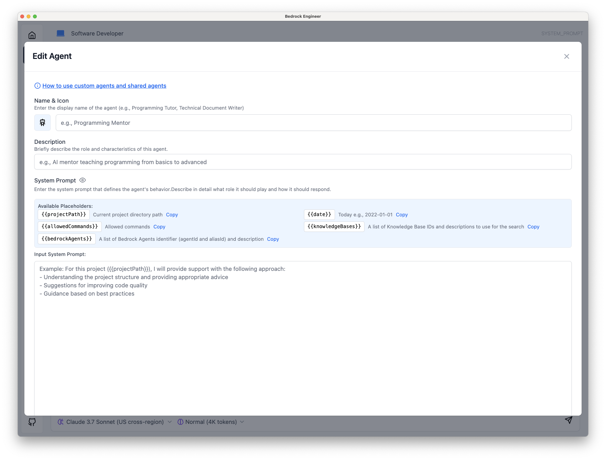

# Agent Customization

Bedrock Engineer allows you to create and customize AI agents to meet your specific needs. This guide explains how to create, modify, and optimize agents for different use cases.

## Creating a Custom Agent

To create a new agent:

1. Navigate to the Agent Chat feature
2. Click the agent selector in the top left corner
3. Select "Create New Agent" or "+" option
4. Fill in the required information in the agent configuration panel

## Agent Configuration

When configuring an agent, you'll need to provide several key pieces of information:

### Basic Information

- **Name**: A distinctive name for your agent
- **Description**: A brief explanation of the agent's purpose and capabilities
- **Icon/Avatar**: (Optional) A visual representation of your agent

### System Prompt

The system prompt is the most critical element that determines an agent's behavior and capabilities. It provides context and instructions that guide the agent's responses.

A well-crafted system prompt should include:

- **Role Definition**: Clearly state what role the agent should assume (e.g., "You are an expert Python developer")
- **Purpose**: Define the primary goal or function of the agent
- **Tone and Style**: Specify how the agent should communicate (formal, friendly, technical, etc.)
- **Constraints**: Identify any limitations or boundaries for the agent
- **Special Instructions**: Include any specific guidelines for handling certain types of requests
- **Tool Usage**: Indicate when and how the agent should leverage available tools

Example system prompt:
```
You are an expert JavaScript developer specializing in React applications. 
Your primary purpose is to help users write clean, efficient code and solve problems in their React projects.
Communicate in a friendly but professional manner, using technical terminology where appropriate.
When asked for code examples, always provide complete, working solutions with comments explaining key concepts.
Use the available tools as follows:
- Use file system tools when examining or modifying project structure
- Use web search when you need current information about libraries or best practices
- Use code execution tools to test and demonstrate solutions
```

### Advanced Settings

Depending on your use case, you might want to configure:

- **Model Selection**: Choose between different AI models based on your needs
- **Temperature Setting**: Adjust how creative or deterministic the agent responses should be
- **Max Token Length**: Configure the maximum length of responses
- **Knowledge Cutoff**: Specify the knowledge cutoff date if relevant

## Optimizing Agent Performance

To get the best results from your custom agents:

1. **Be Specific**: The more specific your system prompt, the more focused the agent's responses will be
2. **Provide Examples**: Include examples of desired interactions in your system prompt
3. **Iterative Refinement**: Test your agent and refine the system prompt based on performance
4. **Tool Configuration**: Carefully select which tools your agent can access based on its purpose

## Managing Custom Agents

Once you've created custom agents, you can:

- **Edit**: Modify any aspect of the agent configuration
- **Duplicate**: Create a copy of an existing agent as a starting point for a new one
- **Delete**: Remove agents you no longer need
- **Export/Import**: Share agent configurations with others or across installations
- **Organize**: Group agents by category or function for easier management

## Best Practices

- Create specialized agents for different domains rather than one general-purpose agent
- Document your system prompts and share successful configurations with your team
- Regularly update your agents to incorporate new capabilities and knowledge
- Use clear naming conventions to easily identify agent purposes



## Next Steps

After customizing your agents, you might want to:

- Configure the [tools available to your agent](./tools-overview.md)
- Learn about [advanced features](./advanced-features/) for more complex use cases
- Explore the [Agent Directory](../agent-directory-organization/) to discover and share agent configurations