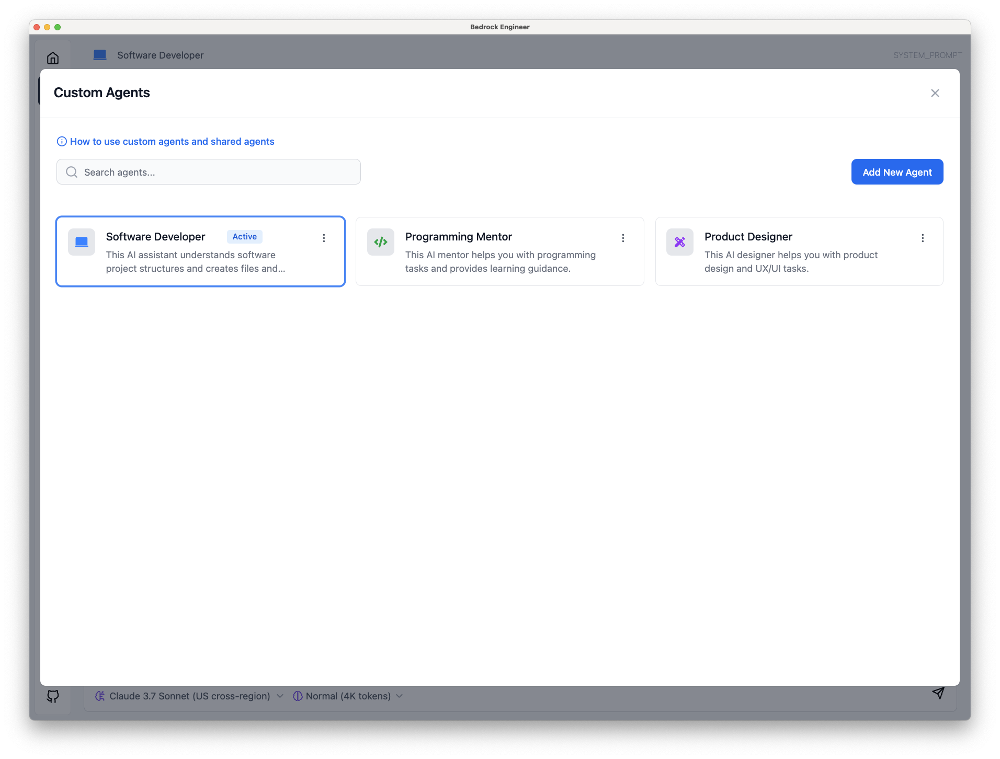

# Getting Started with Agent Chat

Agent Chat provides an autonomous AI assistant that helps with various development tasks. This guide will walk you through the basic setup and usage of the Agent Chat feature in Bedrock Engineer.

## Launching Agent Chat

To start using Agent Chat:

1. Open Bedrock Engineer application
2. Navigate to the "Agent Chat" tab in the main interface
3. If prompted, configure your AWS credentials and region settings

## Understanding the Interface

The Agent Chat interface consists of several key components:

- **Agent Selector**: Located in the top left corner, allows you to choose which agent to interact with
- **Chat Panel**: Main area for interacting with the agent through text input/output
- **Tools Panel**: Located in the bottom left, provides access to customize available tools
- **History Panel**: Accessible from the left sidebar, stores your previous conversations

## Selecting an Agent

Bedrock Engineer provides several pre-configured agents:

- **Software Developer**: Specialized in general software development tasks
- **Programming Mentor**: Assists with programming learning and education
- **Product Designer**: Supports conceptual stage of services and products development

To select an agent:

1. Click the agent selector in the top left corner
2. Choose the agent that best matches your current needs
3. The selected agent is now ready for interaction

## Basic Interaction

Once you've selected an agent, you can:

1. Type your question or request in the input field at the bottom of the chat panel
2. Press Enter or click the send button to submit your message
3. The agent will process your request and provide a response
4. Continue the conversation by sending additional messages

The agent can understand natural language requests and will utilize available tools to assist you with various tasks.

## Next Steps

Now that you're familiar with the basic usage of Agent Chat, you might want to:

- Learn about [Agent Customization](./agent-customization.md) to create your own specialized agents
- Explore the [Tools Overview](./tools-overview.md) to understand what capabilities are available
- Review specific tool capabilities in the [Tool Reference](./tools/) documentation
- Discover [Advanced Features](./advanced-features/) like MCP client integration

## Troubleshooting

If you encounter issues with Agent Chat:

- Ensure your AWS credentials are properly configured
- Check your internet connectivity
- Verify that you have the necessary permissions to access Amazon Bedrock services
- Restart the application if the agent becomes unresponsive