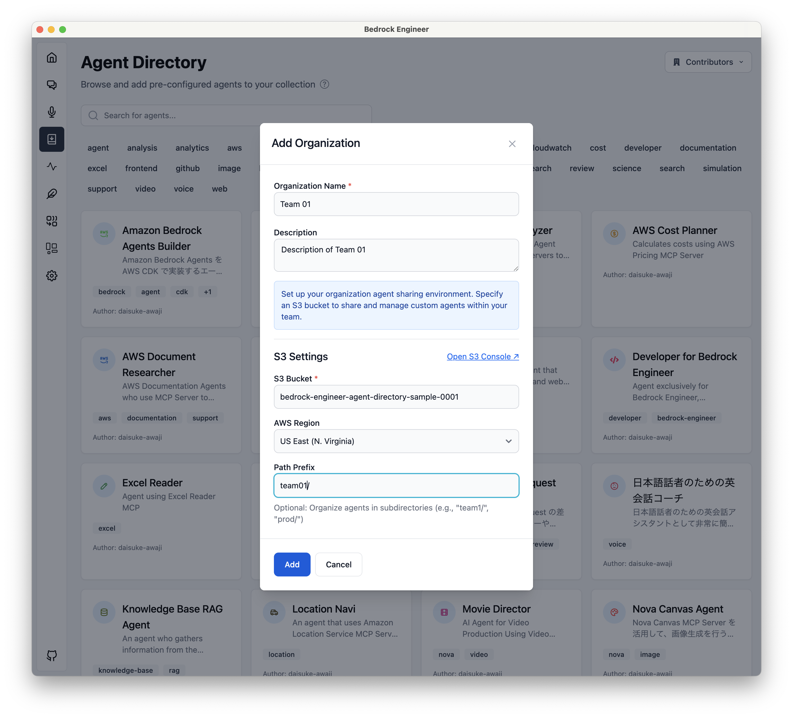
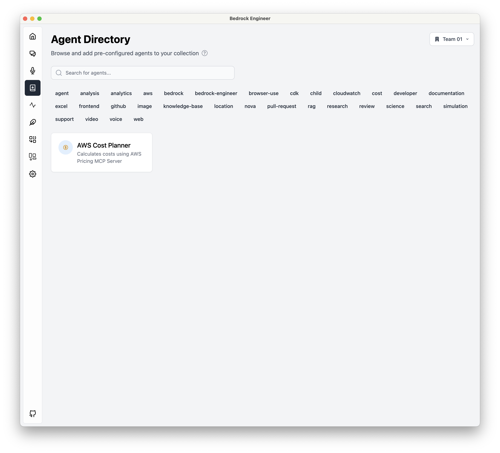

# AgentDirectory Organization Sharing

## Overview

The AgentDirectory organization sharing feature allows you to share agents within your team. Using Amazon S3 buckets, you can manage and distribute agents on an organizational basis.

## Basic Usage

### Step 1: Create an Organization

1. Check the organization selector at the top right of the AgentDirectory page


2. Click the organization selector and select "Add Organization"


3. Enter organization information and S3 settings
   - **Organization Name**: Team or project name
   - **Description**: Purpose of the organization (optional)
   - **S3 Bucket**: S3 bucket name for storing agent files
   - **AWS Region**: Region of the S3 bucket
   - **Path Prefix**: Path within S3 (optional, e.g., `agents/`)



### Step 2: Share Your Custom Agent to Organization's Agent Directory

1. Open the agent settings modal on the Chat Page and click the three-dot menu of an agent. Select "Share to Organization".


2. Select the organization to share with and click "Share".


### Step 3: Using Organization Agents

1. Click on an organization agent to view its details



2. Click the "Add to My Agents" button to use it as your own agent


## Prerequisites

To use the organization sharing feature, you need the following preparations:

### 1. Create an S3 Bucket

Create an S3 bucket to store agent files for your organization.

### 2. Configure AWS Credentials

Set up authentication credentials for the application to access AWS.

### 3. Configure IAM Policies

Organization members need the following S3 permissions to use the organization sharing feature:

#### Minimal IAM Policy Example

```json
{
  "Version": "2012-10-17",
  "Statement": [
    {
      "Effect": "Allow",
      "Action": ["s3:ListBucket"],
      "Resource": ["arn:aws:s3:::your-organization-bucket"]
    },
    {
      "Effect": "Allow",
      "Action": ["s3:GetObject", "s3:PutObject"],
      "Resource": ["arn:aws:s3:::your-organization-bucket/*"]
    }
  ]
}
```

#### Permission Descriptions

- **s3:ListBucket**: Retrieve list of agent files in organization bucket
- **s3:GetObject**: Read shared agent files from organization
- **s3:PutObject**: Share your custom agents to organization

#### Permission Levels

**Read-only Members** (using shared agents only):

```json
{
  "Version": "2012-10-17",
  "Statement": [
    {
      "Effect": "Allow",
      "Action": ["s3:ListBucket", "s3:GetObject"],
      "Resource": [
        "arn:aws:s3:::your-organization-bucket",
        "arn:aws:s3:::your-organization-bucket/*"
      ]
    }
  ]
}
```

**Members with Sharing Permissions** (can also share agents):

```json
{
  "Version": "2012-10-17",
  "Statement": [
    {
      "Effect": "Allow",
      "Action": ["s3:ListBucket", "s3:GetObject", "s3:PutObject"],
      "Resource": [
        "arn:aws:s3:::your-organization-bucket",
        "arn:aws:s3:::your-organization-bucket/*"
      ]
    }
  ]
}
```

### 4. Security Considerations

- **Bucket Encryption**: Recommended to enable server-side encryption for S3 buckets
- **Access Logging**: Enable S3 access logs if necessary
- **Versioning**: Consider enabling S3 versioning as protection against accidental deletion

For detailed AWS configuration, please refer to the application's configuration guide.

## Common Issues

### Organization Not Displayed

- Verify that AWS credentials are correctly configured
- Check if you have access permissions to the specified S3 bucket

### Agents Not Loading

- Verify that the S3 bucket name and path prefix are correctly configured
- Check if agent definition files (JSON format) are placed in the S3 bucket
- Verify network connection and AWS region settings

### Organization Deletion

When you delete an organization, you will no longer be able to access that organization's shared agents. We recommend adding important agents to your personal agents before deletion.
